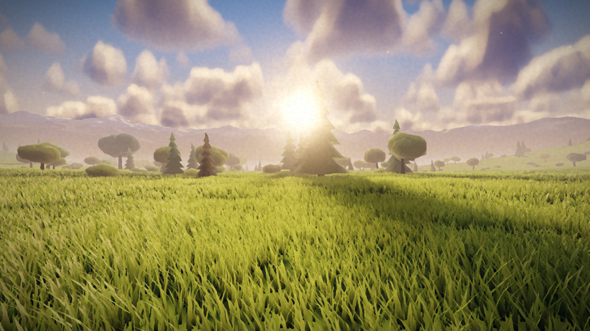
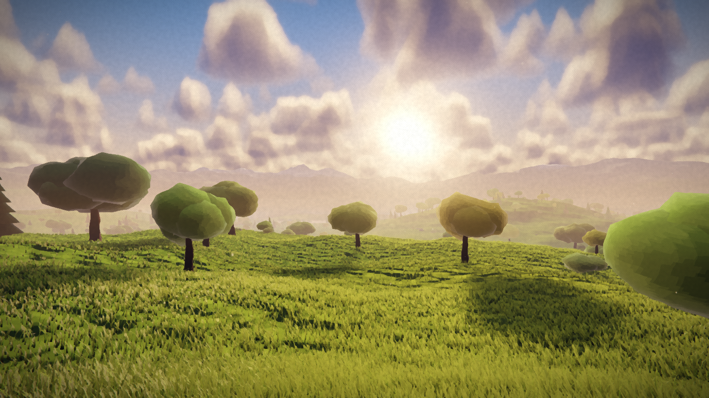
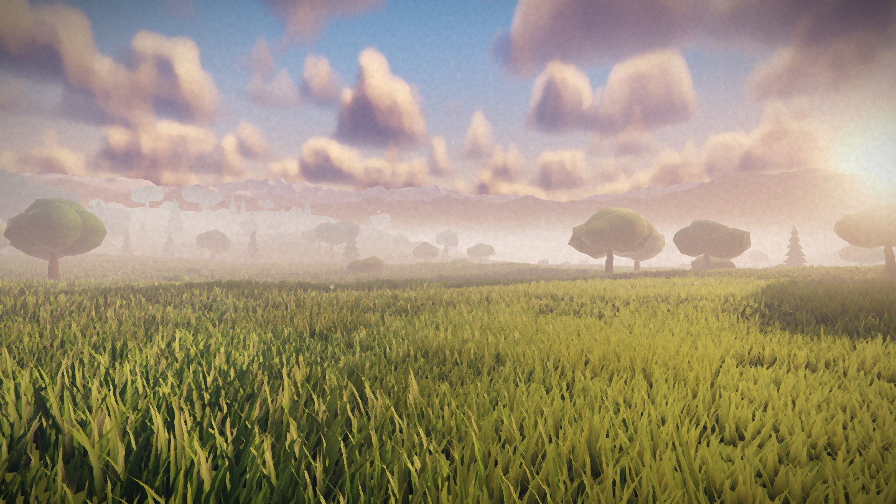
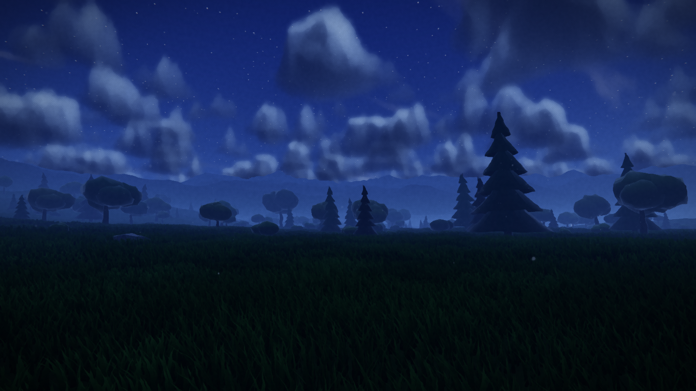
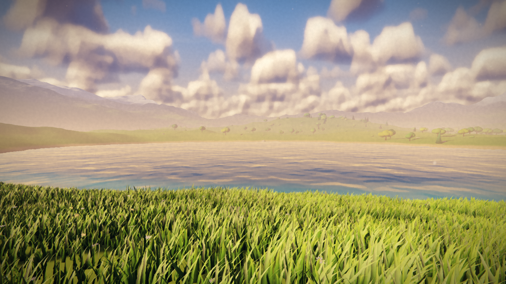
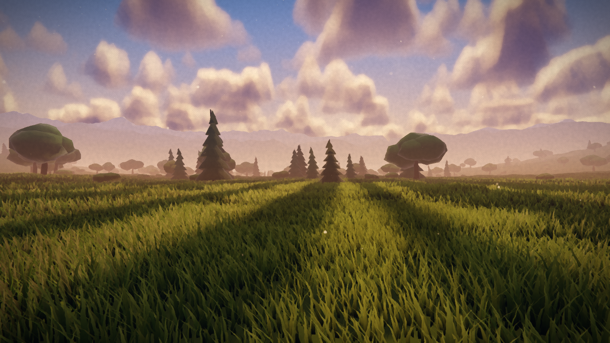

# 3D Scenes

A workbench for real-time 3D scenes and game experiments. Each scene is a
self-contained folder that drops in and out; a dev mode lets you click anything
in the world, inspect it, tweak it live, and hand it to Claude with a note.

Built on three.js. No engine, no editor — just the pieces needed to keep
experiments from stepping on each other.

| | |
|---|---|
|  |  |
|  |  |
|  |  |

## Run it

```bash
npm install
npm run dev      # http://localhost:5180
```

`npm run build` produces a static bundle in `dist/`. Needs a WebGL2 browser.

## Scenes

| Scene | |
|---|---|
| **Meadowlight** | A painterly grassland at golden hour. The full write-up is below. |
| **Sandbox** | A bare starting point — gradient sky, grid, lit primitives. Copy it to begin. |

Press <kbd>Tab</kbd> for the launcher, or open `?scene=<id>` directly. The last
scene you had open is remembered.

```bash
npm run new-scene -- moonlit-ruins "Moonlit Ruins"
```

…or just copy `src/scenes/sandbox/` by hand. See
[`src/scenes/README.md`](src/scenes/README.md) for the (short) contract. Scenes
never import from each other, so deleting a folder can't break another one.

## Dev mode

Press <kbd>`</kbd>.

- **Click the world to select.** Ordinary meshes are raycast; instanced systems
  resolve to a concrete instance, so you get *"tree #230, kind 2"* rather than
  *"the trees"*. <kbd>⌥</kbd>click cycles through everything under the cursor,
  <kbd>⇧</kbd>click adds to the selection.
- **Outliner** lists every registered node with visibility and solo toggles.
- **Inspector** shows the source file, world position, instance index, live
  stats, and the node's own parameters — editable in place.
- **Send to Claude** (<kbd>⌘</kbd><kbd>⏎</kbd>) writes what you're pointing at
  into `.dev/`:

```
.dev/handoff.md      human- and agent-readable summary
.dev/handoff.json    structured: node id, source file, instance, camera, params
.dev/history.jsonl   every handoff, appended
.dev/shots/          the screenshot that went with it
```

That's the point of the whole thing: you point at a tree, type "too dark against
the sky", and Claude gets the file path, the instance index, the world position,
the camera, and which parameters you'd moved off default. The markdown also
lands on your clipboard as a fallback.

The bridge is a dev-server plugin (`tools/vite-dev-bridge.js`) and is never part
of a build.

## Controls

| | |
|---|---|
| `W A S D` / arrows | move |
| mouse | look (click the canvas to capture the pointer) |
| `Shift` | sprint |
| `F` | fly — forward follows where you look |
| `Space` / `Q` | up / down while flying |
| `1`–`5` | scene viewpoints |
| scroll | zoom, `R` resets |
| `Tab` | scene launcher |
| `` ` `` | dev mode |
| `C` | cinematic drift |
| `H` | hide the interface |
| `P` | save a screenshot |

On touch: drag the left half to walk, the right half to look.

## Layout

```
src/
  engine/       renderer shell, scene manager, input, controller,
                params schema, node registry, assets, audio, store
  devtools/     dev mode: picker, gizmo, inspector, handoff bridge
  ui/           panel, launcher, intro — all schema-driven
  scenes/
    grassland/  Meadowlight, fully self-contained
    sandbox/    the starter template
tools/          vite dev bridge + headless screenshot / perf harness
```

The engine deliberately holds only what more than one scene needs. When a second
scene wants the terrain or grass systems, they get promoted out of `grassland/`
then — not before.

---

# Meadowlight

## How it works

Everything is procedural and lives in a handful of systems that share one
uniform pool (`src/scenes/grassland/Uniforms.js`), so one update per frame propagates to
every material.

**Heightfield** (`src/scenes/grassland/gen/HeightField.js`) — the terrain is baked once on the
GPU into a float texture holding height, normal and a grass-density mask, then
read back to the CPU for collision and object scattering. A second pass marches
the field toward the sun to bake terrain self-shadowing and ambient occlusion;
it re-bakes, throttled, whenever the sun moves.

**Terrain** (`src/scenes/grassland/world/Terrain.js`) — a six-level geometry clipmap that follows
the camera and samples the heightfield in the vertex shader, so detail is dense
underfoot and cheap at the horizon. Biome colour, sward texture and alpine snow
are shaded per-pixel, with high-frequency detail faded out with distance so
distant ridges don't alias into static.

**Grass** (`src/scenes/grassland/world/Grass.js`) — three instanced layers of blades. Each layer
is a repeating tile that wraps to the copy nearest the camera, so the field is
effectively endless with no popping. Blades read their base height, ground
normal and density straight from the heightfield, bend along a quadratic spine
driven by the wind field, and shade with wrapped diffuse, anisotropic sheen and
a transmission term — the last is what makes the field glow when the sun is
behind it. A screen-space width floor keeps distant blades from sub-pixel
flickering.

**Wind** (`src/scenes/grassland/shaders/common.js`) — one shared field of travelling gust fronts
plus finer ripples. Grass, flowers, trees, clouds, pollen and the lake surface
all read from it, so a gust crossing the meadow moves everything together.

**Sky** (`src/scenes/grassland/world/Sky.js`) — a stylised analytic gradient plus a half-
resolution cloud pass. Coverage noise decides how tall each cloud column grows,
3D noise erodes the tops, and light marches toward the sun through the deck for
bright crowns and shadowed bases. The same coverage noise is projected onto the
ground so cloud shadows drift across the meadow.

**Shadows** (`src/scenes/grassland/world/SunShadow.js`) — a single camera-following cascade for
the solid props, texel-snapped so edges don't crawl. Terrain shadows come from
the baked pass instead, which is what allows the long mountain shadows.

**Post** (`src/scenes/grassland/post/Composer.js`) — the scene renders to an HDR MSAA target
where the sky writes alpha 1 and everything else writes 0; that alpha channel is
the god-ray occlusion mask, so grass, trees and clouds punch real shafts out of
the light. Then bloom, ACES tonemapping, and a painterly pass: a Kuwahara filter
that flattens colour into brush-like fields, a flow-noise brush wobble, colour
grading and a canvas tooth.

## Tuning

`src/scenes/grassland/Settings.js` holds the atmosphere keyframes — a table of sun colour,
sky gradient, haze and exposure across the day. Editing that table is the
fastest way to change the whole look.

Quality tiers scale the grass instance count (≈110k on low to ≈785k on ultra)
and the Kuwahara radius. If it runs hot, drop to **medium** first.

## Development helpers

```bash
node tools/shot.mjs shots/out.png       # single headless screenshot
node tools/shots.mjs spec.json          # batch of shots with camera/params
node tools/perf.mjs '[{"name":"a"}]'    # fps under different settings
node tools/motion.mjs                   # confirm the wind is animating
node tools/verify.mjs                   # check controls + defaults behave
```
These need the dev server running.

## Notes

* No assets: the terrain, grass, trees, rocks, flowers, clouds and water are all
  generated in code at load. First load bakes the heightfield on the GPU and
  reads it back, which takes about a second.
* The whole scene is custom `ShaderMaterial`s — three.js is used for the WebGL
  plumbing, not its material system — so lighting, fog and wind stay consistent
  across every object from one shared uniform pool.
